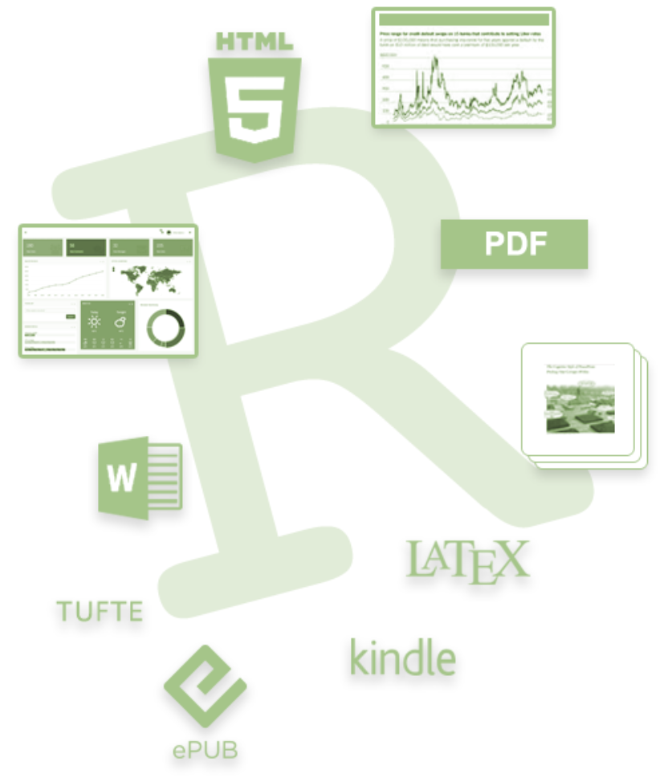
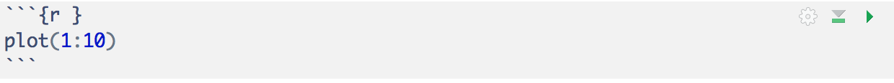
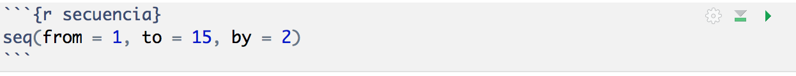
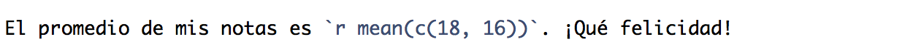
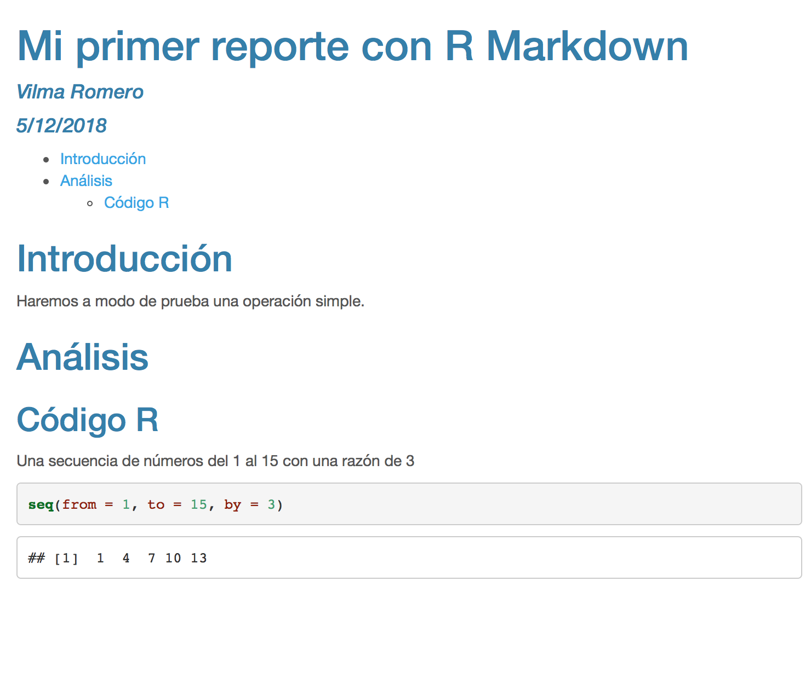

```{r setup, include=FALSE}
options(htmltools.dir.version = FALSE)
library(ggplot2)
#library(plotly)
library(dplyr)
livedemosign <- function(top, left, deg) {
  htmltools::div("Live Demo!", class="faa-flash animated",
                 style=glue::glue("border:solid; border-color:black; position:absolute; top:{top}%; left:{left}%; font-size:36px; padding:4px; background-color:white; color:black;transform:rotate({deg}deg);")
                 )
}
```


class: bg-main6 

# Al finalizar este taller, serás capaz de:

</br>

### - Escribir un reporte rápido y efectivo con el paquete R Markdown.

### - Generar diferentes formatos de reportes reproducibles (HTML, Word, PDF, etc.).

### - Entender que la clave para comunicar los hallazgos con otros investigadores y tomadores de decisiones es mediante la .orange[reproducibilidad].

---

class: split-two white 

.column.bg-main1[.content[

# **¿Qué es R Markdown?**

<br>

### 1) Estructura unificada que permite combinar:

      - Código R
      - Resultados
      - Comentarios en prosa

### 2) Los documentos R Markdown:

###      - son .orange[completamente reproducibles], se pueden regenerar automáticamente al actualizar tanto códigos R o datos empleados.

###      - se pueden .orange[convertir en en diferentes formatos] como: HTML, PDF, documentos Word, aplicaciones web interactivas, entre otros.
    
]]

.column[.content.vmiddle.center[



]]

---
class: bg-main6

# Instalación de R Markdown

### - Instalar el paquete en RStudio

```{r, eval = FALSE, echo = TRUE}
install.packages("rmarkdown")
```

### - Activar el paquete instalado

```{r, eval = FALSE, echo = TRUE}
library(rmarkdown)
```

---
class: bg-main6

# Empezando con R Markdown

</br> 

### 1. File -> New File -> R Markdown

### 2. Proporcionar un título y un nombre de autor.

### 3. Dejar las opciones por defecto: Documento HTML.

### 4. Guardar el archivo .orange[**.Rmd**] en alguna carpeta o proyecto.

### 5. Seleccionar la opción .orange[**knit**] y se generará un archivo HTML.

---
class: bg-main6

# Componentes Principales

### 1. Encabezado llamado **YAML** (**Y**et **A**nother **M**arkup **L**anguage), que contiene algunos metadatos.
```{r, eval=FALSE}
---
title: "Mi primer reporte con R Markdown"
author: "Vilma Romero"
output: html_document
---
```

### 2. Códigos R llamados **chunks**.



### 3. Texto mezclado con formato de texto simple usando la sintáxis de Markdown. 

> ### <span style="color:#562457; background:yellow">RStudio -> Help -> Markdown Quick Reference</span> `r anicon::cia("images/left-arrow.png", animate="horizontal", rtext="&nbsp;")`


---
class: bg-main6

# **Flujo de trabajo**


<br>

### 1. Al ejecutar el documento con **knit** , el archivo .Rmd es compilado con .orange[**knitr**] creando un nuevo documento de formato markdown (**.md**), el cual incluye el código y su salida.

### 2. El archivo **.md** es procesado por .orange[***pandoc***] creando el documento final en el formato escogido.

---

layout: false
class: bg-main1 split-30 hide-slide-number

.column[

]
.column.slide-in-right[.content.vmiddle[
.sliderbox.shade_main.pad1[
.font5[Formateo]
]
]]


---
class: bg-main6

# Formato Básico

### - Encabezados

- `#`, encabezado de nivel 1
- `##`, encabezado de nivel 2
- `###`, encabezado de nivel 3

### - Listas

- Listas con viñetas, usar `*` o `-` para el primer nivel. Para el nivel 2, usar `<tab> +`.
- Listas enumeradas, usar los números seguidos de un punto `1.`, `2.`, ...

### - Cursiva y Negrita

- Para cursiva, el texto va entre asteriscos.
- Para negrita, el texto va entre dos asteriscos.

---
class: bg-main6

### - Insertar imágenes

- ``


### - Insertar hiperlinks

- `[Etiqueta del link](Link)`

> [**Hojas de Referencia de RStudio**](https://www.rstudio.com/resources/cheatsheets/)

---
class: split-two white 

.column.bg-main1[.content[
# Insertar Códigos
<br>

### Para insertar un cuadro de código R al documento, se debe insertar un .orange[***chunk***].

### - Atajo: Cmd/Ctrl + Alt + I

### - Botón Insert -> R 
###   (ubicado en la barra superior de edición).

### - Tipeando manualmente.

### - Los chunks pueden tener nombres.

### - Para código dentro del texto, usar comillas simple con una r.

]]

.column[.content[

<br><br><br><br><br>


<br>



<br>




]]

---
class: bg-main6

# Opciones de control de un Chunk
<br>

- `eval = FALSE`, no se evalúa el código.

- `include = FALSE`, evalúa el código pero no muestra los resultados en el 
documento final.

- `echo = FALSE`, no muestra el código en el documento, pero sí los resultados obtenidos.

- `message = FALSE`, evita mostrar mensajes en el documento final.

- `warning = FALSE`, evita mostrar warnings en el documento final.

- `error = TRUE`, permite que se ejecute el documento a pesar de errores.

---
class: split-two white 

.column.bg-main1[.content[
# Encabezado YAML 
## (Componentes Principales)
<br>

### - .orange[**output**], formato del documento final.

      - html_document, pdf_document, word_document
      - ioslides_presentation, slidy_presentation 
      - beamer_presentation

### - .orange[**title**], título del documento.

### - .orange[**author**], autor del documento.

### - .orange[**date**], día de publicación.

]]

.column[.content.vmiddle[

#### **`Personalización Básica de YAML`**

```{r, eval=FALSE}
---
title: "Mi primer reporte con R Markdown"
author: "Vilma Romero"
date: "5/12/2018"
output: html_document
---
```

<br>

#### **`Personalización Avanzada de YAML`**

```{r, eval=FALSE}
---
title: "Mi primer reporte con R Markdown"
author: "Vilma Romero"
date: "5/12/2018"
output: 
  html_document:
    toc: yes
    toc_depth: 2
    theme: cerulean
    highlight: pygments
---
```

]]

---
class: split-two white 

.column.bg-main1[.content[
<br>
## Tabla de contenidos

- Opción .orange[**toc**]

- Se puede especificar la cantidad de niveles con la opción .yellow[**toc_depth**]. 

<br>

## Apariencia y Estilos - HTML

- .orange[**theme**], controla la fuente y el estilo de todo especificando el tema Bootstrap de la página. Los temas se extraen de la librería de temas [Bootswatch](https://bootswatch.com).
    + united, cosmo, cerulean, journal, flatly, yeti, ...
    
- .orange[**highlight**], controla el estilo de resaltado de código en el chunk.
    + default, tango, pygments, kate, monochrome, espresso, zenburn, haddock, textmate.


]]

.column[.content.vmiddle[

```{r, eval=FALSE}
---
title: "Mi primer reporte con R Markdown"
author: "Vilma Romero"
date: "5/12/2018"
output: 
  html_document:
    toc: yes
    toc_depth: 2
    theme: cerulean
    highlight: pygments
---
```


]]

---
class: bg-main6

# Tablas con kable

```{r, echo = TRUE, message=FALSE, warning=FALSE}
library(knitr)
kable(head(iris), format = "html", caption = "Muestra de Iris")
```

<br>

### Se pueden ver mayores detalles en el siguiente enlace [Create Awesome HTML Table with knitr::kable and kableExtra](https://cran.r-project.org/web/packages/kableExtra/vignettes/awesome_table_in_html.html)

---
class: bg-main6

# Tablas con DT::datatable

```{r, echo = TRUE}
DT::datatable(iris[, 1:5], extensions = 'ColReorder', 
              options = list(colReorder = TRUE, 
                             pageLength = 5))
```


---
class: bg-main6

# Matemática en R Markdown  

- Dentro del texto, usar los símbolos de dólar `$`.
    + El resultado de $3 + 4 = 7$.
    + El área del círculo está definido por $\pi \times r^2$
    
- Para visualizaciones matemáticas en bloque usar `$$`.

$$\sum_{i=1}^{n}{x_i^2} = \frac{n \times (n+1) \times (2n+1)}{6}$$

- En resumen, <span style="color:#562457; background:yellow">usar código latex para escribir ecuaciones matemáticas</span>.


---
class: bg-main6

# Recursos Adicionales
<br>

### - [**Sitio oficial de R Markdown**](https://rmarkdown.rstudio.com)

### - [**R Markdown: The Definitive Guide**](https://bookdown.org/yihui/rmarkdown/) (.red[**Yihui Xie, J. J. Allaire, Garrett Grolemund**])

### - [**R Markdown Cheatsheet**](https://www.rstudio.com/resources/cheatsheets/)

### - [**R Markdown Reference Guide**](https://www.rstudio.com/wp-content/uploads/2015/03/rmarkdown-reference.pdf)

### - [**R for Data Science - Capítulo 27**](http://r4ds.had.co.nz/r-markdown.html) (.red[**Garrett Grolemund y Hadley Wickham**])


---
class: bg-main6

# **¡Muchas gracias!**
<br>
### - Laboratorio de Políticas Públicas de la PUCP.
### - Organizadoras de R-Ladies Lima.
### - Andrea Pontex por el diseño del póster.


---
class: bg-main6

<br>
<center>
<h2>
<span style="color:black">Vilma S. Romero Romero</span>
</h2>
<br>
<h3>
`r anicon::faa('envelope', size = 'xs', animate='float', rtext='<a href="mailto:vromeror@uni.edu.pe"><span style="color:#562457">&nbsp;&nbsp;vromeror@uni.edu.pe</span></a>')`
</h3>
<h3>
`r anicon::faa('globe', size = 'xs', animate='float', rtext='<a href="https://vilmaromero.github.io"><span style="color:#562457">&nbsp;&nbsp; https://vilmaromero.github.io</span></a>')`
</h3>
<h3>
`r anicon::faa('github', size = 'xs', animate='float', rtext='<a href="https://github.com/VilmaRomero"><span style="color:#562457">&nbsp;&nbsp; @VilmaRomero</span></a>')`
</h3>
<h3>
`r anicon::faa('twitter', size = 'xs', animate='float', rtext='<a href="http://twitter.com/vilsurr"><span style="color:#562457">&nbsp;&nbsp; @vilsurr</span></a>')`
</h3>
</center>

<br><br><br>

### Estas slides fueron creadas usando el paquete .red[**xaringan**] (https://github.com/yihui/xaringan) y el tema .orange[**kunoichi**] (desarrollado por Emi Tanaka).

